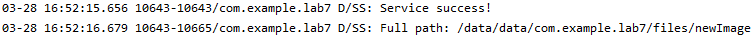
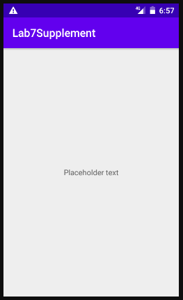
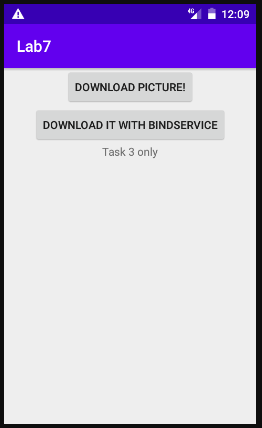
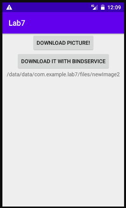
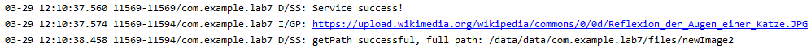

# Лабораторная работа №7. Сервисы и Broadcast Receivers.
## Цели:
Получить практические навыки разработки сервисов (started и bound) и Broadcast Receivers.

## Задачи:
### Задача 1. Started сервис для скачивания изображения.
Мне требуется разработать аналог приложения из лабораторной работы №6, скачивающий картинку из Интернета с использованием Started сервиса. Кроме того, он должен рассылать broadcast сообщения по завершению скачивания.

Начну с листинга MainActivity.kt, в нём происходит настройка кнопки, отвечающей за запуск нашего сервиса:
```
package com.example.lab7

import android.content.Intent
import androidx.appcompat.app.AppCompatActivity
import android.os.Bundle
import android.util.Log
import kotlinx.android.synthetic.main.activity_main.*
import kotlinx.coroutines.*
import java.io.InputStream
import java.net.URL

class MainActivity : AppCompatActivity() {
    private val url = "https://upload.wikimedia.org/wikipedia/commons/0/0d/Reflexion_der_Augen_einer_Katze.JPG"

    override fun onCreate(savedInstanceState: Bundle?) {
        super.onCreate(savedInstanceState)
        setContentView(R.layout.activity_main)
        Log.d("CP","Task 1 running")
        button.setOnClickListener {
            startService(Intent(this, MyService::class.java).putExtra("URL", url))
        }
    }
}
```

Кроме тривиального "startService()" ничего нового в коде использовано не было.

Далее, перейдём к листингу MyService.kt:
```
package com.example.lab7

import android.app.Service
import android.content.Context
import android.content.Intent
import android.os.IBinder
import android.graphics.Bitmap
import android.graphics.BitmapFactory
import android.util.Log
import kotlinx.coroutines.CoroutineScope
import kotlinx.android.synthetic.main.activity_main.*
import kotlinx.coroutines.Dispatchers
import kotlinx.coroutines.Job
import kotlinx.coroutines.launch
import java.io.IOException
import java.io.InputStream
import java.net.URL

class MyService : Service() {
    lateinit var downloadingJob: Job

    override fun onBind(intent: Intent): IBinder? {
        return null
    }

    override fun onStartCommand(intent: Intent?, flags: Int, startId: Int): Int {
        lateinit var image: Bitmap
        lateinit var path: String
        val imageName = "newImage"
        downloadingJob = CoroutineScope(Dispatchers.IO).launch(Dispatchers.IO) {
            try {
                val input: InputStream = URL(intent?.getStringExtra("URL")).openStream()
                image = BitmapFactory.decodeStream(input)
            } catch(e: Exception) {
                e.printStackTrace()
                Log.e("SP", "Service problem with downloading / decoding")
            }
            try {
                image.compress(Bitmap.CompressFormat.PNG, 100, applicationContext.openFileOutput(imageName, Context.MODE_PRIVATE))
                path = applicationContext.getFileStreamPath(imageName).absolutePath
                sendBroadcast(Intent("Sending path to image").putExtra("path", path))
            } catch(e: Exception) {
                e.printStackTrace()
                Log.e("SP", "Service problem with saving file / broadcasting")
            }
            Log.d("SS", "Full path: $path")
        }
        Log.d("SS", "Service success!")
        stopSelf(startId)
        return START_NOT_STICKY
    }

    override fun onDestroy() {
        downloadingJob.cancel()
    }

}
```

onStartCommand() вызывается из нашей MainActivity по нажатию на кнопку, и запускается скачивающая изображение корутина. Первый блок try-catch скачивает и дешифрует изображение (или выводит уведомление об ошибке), второй - сохраняет изображение, запоминает путь к картинке и броадкастит его.

"return START_NOT_STICKY" означает, что наш сервис не будет перезапущен после того, как был убит системой. 

Кроме onStartCommand() в сервисе есть onDestroy(), функция, корректно прекращающая работу корутины в случае уничтожения сервиса; а также функция onBind(), ничего не делающая - наш сервис не Bound.

В этом сервисе скачивание файла проводилось с использованием корутины. Dispatchers.IO указывает корутине работать в IO потоке, где и должны выполняться "тяжёлые" операции. Поэтому пользовательский интерфейс тормозить не будет.

Как можно видеть по диагностическим сообщениям, приложение работает корректно:



### Задача 2. Broadcast Receiver.
Передо мной стоит задача разработайте два приложения: первое приложение содержит 1 activity с 1 кнопкой, при нажатии на которую запускается сервис по скачиванию файла. Второе приложение содержит 1 broadcast receiver и 1 activity. Broadcast receiver по получении сообщения из сервиса инициирует отображение пути к изображению в TextView в Activity.

Собственно первое приложение у нас уже есть - это приложение из первой задачи. Осталось написать второе приложение.

Несколько приложений в одном проекте можно создать, например, выбрав File > New > New Module > Phone & Tablet Module.

Соответствующий второму приложению layout-файл состоит из одного лишь TextView, которое примет путь к загруженному файлу.

Листинг MainActivity.kt:
```
package com.example.lab7supplement

import android.content.BroadcastReceiver
import android.content.Context
import android.content.Intent
import android.content.IntentFilter
import androidx.appcompat.app.AppCompatActivity
import android.os.Bundle
import android.util.Log
import kotlinx.android.synthetic.main.activity_main.textView

class MainActivity : AppCompatActivity() {
    inner class MyReceiver : BroadcastReceiver() {
        override fun onReceive(context: Context, intent: Intent) {

            val path = intent.getStringExtra("path")
            Log.v("BR", "Path to file recieved $path")
            textView.text = path
        }
    }

    override fun onCreate(savedInstanceState: Bundle?) {

        super.onCreate(savedInstanceState)
        setContentView(R.layout.activity_main)
        registerReceiver(MyReceiver(), IntentFilter("Sending path to image"))
    }
}
```

В OnCreate() мы регистрируем BroadcastReceiver, он будет принимать только сообщения с Intent.action "Sending path to image". В самом MyReceiver переопределяем onReceive() - при получении сообщения изменяем текст в textView. 

В подтверждение работоспособности приведу скриншоты принимающего приложения, соответственно до и после нажатия кнопки в "скачивающем" приложении:




### Задача 3. Bound Service для скачивания изображения.

Требуется сделать разработанный сервис одновременно bound И started (т.е. использующий bindService вместо startService), переопределив метод onBind(); а также добавить: в первое приложение - TextView, в сервис - отправку обратного сообщения с местоположением скачанного файла. При получении сообщения от сервиса приложение должно отобразить путь к файлу на экране.

Изменения в сервис и активность достаточно велики, чтобы оформить их как новые сервис и активность.

Листинг MainActivity2.kt:
```
package com.example.lab7

import android.app.Service
import android.content.ComponentName
import android.content.Context
import android.content.Intent
import android.content.ServiceConnection
import android.os.*
import androidx.appcompat.app.AppCompatActivity
import android.util.Log
import com.example.lab7.databinding.ActivityMain2Binding
import kotlinx.android.synthetic.main.activity_main2.*

class MainActivity2 : AppCompatActivity() {
    private val url = "https://upload.wikimedia.org/wikipedia/commons/0/0d/Reflexion_der_Augen_einer_Katze.JPG"
    lateinit var messenger: Messenger

    inner class mConnection : ServiceConnection {
        var messengerConnect : Messenger? = null

        override fun onServiceConnected(className: ComponentName, service: IBinder) {
            messengerConnect = Messenger(service)
            Log.w("SC", "onServiceConnected happened")
        }

        override fun onServiceDisconnected(className: ComponentName) {
            messengerConnect = null
            Log.w("SC", "onServiceDisconnected happened")
        }
    }

    inner class ActivityHandler(looper: Looper) : Handler(looper) {
        override fun handleMessage(msg: Message) {
            if (msg.what != 42) {
                super.handleMessage(msg)
                return
            }
            textView.text = msg.obj as String
        }
    }

    val myConnectionService = mConnection()

    override fun onCreate(savedInstanceState: Bundle?) {
        super.onCreate(savedInstanceState)
        setContentView(R.layout.activity_main2)
        Log.d("CP","Task 3 running")
        messenger = Messenger(ActivityHandler(mainLooper))

        bindService(Intent(this, MyService2::class.java),
            myConnectionService, Context.BIND_AUTO_CREATE)

        button.setOnClickListener {
            startService(Intent(this, MyService2::class.java).putExtra("URL", url))
        }

        button2.setOnClickListener {
            val msg: Message = Message.obtain()
            msg.obj = url
            msg.what = 42
            msg.replyTo = messenger
            try {
                myConnectionService.messengerConnect?.send(msg)
            } catch (e: RemoteException) {
                Log.e("BT", "Message not sent")
                e.printStackTrace()
            }
        }
    }
}
```

Здесь, мы в первую очередь привязываем наш сервис (точнее, его ServiceHandler через onBind(), что можно увидеть ниже) к ServiceConnection нашей активности - интерфейсу, позволяющему отслеживать состояние подключенного(-ых) сервиса(-ов). Первая кнопка не изменилась; вторая формирует и высылает сообщение сервису через ServiceConnection.

ActivityHandler, по принятию сообщения от сервиса, изменит текст textView, или выдаст ошибку при некорректном формате.

Листинг Service2.kt:
```
package com.example.lab7

import android.app.Service
import android.content.Context
import android.content.Intent
import android.graphics.Bitmap
import android.graphics.BitmapFactory
import android.os.*
import android.util.Log
import kotlinx.coroutines.CoroutineScope
import kotlinx.coroutines.Dispatchers
import kotlinx.coroutines.Job
import kotlinx.coroutines.launch
import java.io.IOException
import java.io.InputStream
import java.net.URL

class MyService2 : Service() {

    private lateinit var myMessenger: Messenger
    lateinit var downloadingJob: Job
    val imageName = "newImage2"

    inner class ServiceHandler(looper: Looper) : Handler(looper) {

        override fun handleMessage(msg: Message) {
            if (msg.what != 42) {
                Log.e("IH", "Wrong Message received!")
                super.handleMessage(msg)
                return
            }
            Log.v("IH", "Message received!")
            val url = msg.obj as String
            val replyTo = msg.replyTo

            CoroutineScope(Dispatchers.IO).launch(Dispatchers.IO) {
                val newMsg = Message.obtain()
                val path = getPath(url, imageName)
                newMsg.obj = path
                newMsg.what = 42
                replyTo.send(newMsg)
            }
        }
    }

    fun getPath(url: String, imageName: String): String {
        lateinit var image: Bitmap
        lateinit var path: String

        Log.i("GP", url)
        try {
            val input: InputStream = URL(url).openStream()
            image = BitmapFactory.decodeStream(input)
        } catch(e: Exception) {
            e.printStackTrace()
            Log.e("SP", "Service problem with downloading / decoding")
        }
        try {
            image.compress(Bitmap.CompressFormat.PNG, 100, applicationContext.openFileOutput(imageName, Context.MODE_PRIVATE))
            path = applicationContext.getFileStreamPath(imageName).absolutePath
        } catch(err: Exception) {
            err.printStackTrace()
            Log.e("SP", "Service problem with saving file / broadcasting")
        }
        Log.d("SS", "getPath successful, full path: $path")
        return path
    }

    fun getPath(intent: Intent?, imageName: String): String {
        return getPath(intent?.getStringExtra("URL") ?: throw IOException(), imageName)
    }

    override fun onBind(intent: Intent): IBinder? {
        return Messenger(ServiceHandler(Looper.getMainLooper())).binder
    }

    override fun onStartCommand(intent: Intent?, flags: Int, startId: Int): Int {
        lateinit var path: String

        downloadingJob = CoroutineScope(Dispatchers.IO).launch(Dispatchers.IO) {
            path = getPath(intent, imageName)
            sendBroadcast(Intent("Sending path to image").putExtra("path", path))
        }

        Log.d("SS", "Service success!")
        stopSelf(startId)
        return START_NOT_STICKY
    }

    override fun onDestroy() {
        downloadingJob.cancel()
    }

}
```

В сервисе осталась всё те же onDestroy() и onStartCommand() - код последней был перенесён в отдельную функцию getPath(), возвращающую искомый путь к изображнию, но в остальном изменений нет.

При получении ServiceHandler сообщения, оно обрабатывается handleMessage, которая получает искомый путьс помощью уже знакомого нам getPath(), формирует и отправляет ответное сообщение. Или же, если входящее сообщение - не то, что мы ожидали (obj != 42), ServiceHandler выдаст ошибку.

Приведу скриншоты до нажатия на button2:



И после нажатия:



При этом функциональность сервиса как Started сохранилась, что тоже подтвердило тестирование:



## Вывод:

При выполнении данной работы я научился на практике работать с сервисами и представляю себе разницу между bound и started сервисами. Кроме этого, при решении задач я использовал обмен сообщениями (Message, в моём случае состоящей из what (произвольный объект, здесь используемый как идентификатор сообщения), obj - (само сообщение, здесь - url или путь к файлу) и replyTo (ссылка на handler, "кому отвечать"), и функцией Handler'а handleMessage()) для успешного взаимодействия между активностью и сервисом. Также, я ознакомился с гибким ServiceConnection, позволяющий динамично реагировать на подключение/отключение сервисов. Сама лабораторная работа дала повод вспомнить навыки работы с корутинами, полученные в предыдущей лабораторной работе.

На выполнение работы и разбор материалов ушло приблизительно 3 дня.